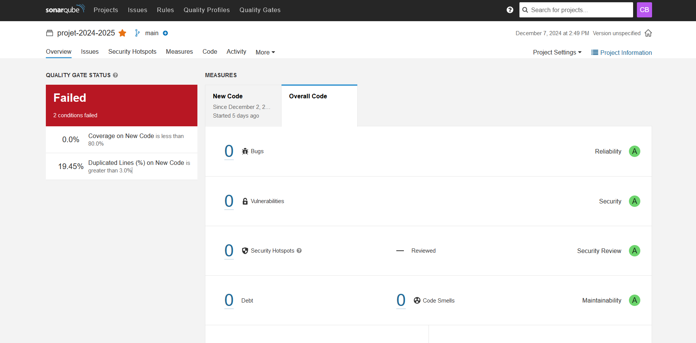
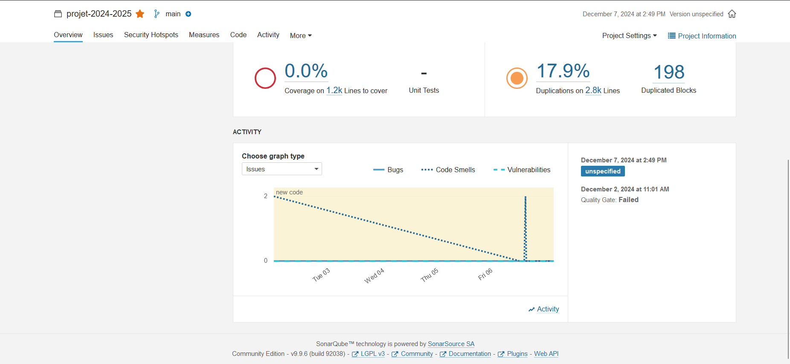
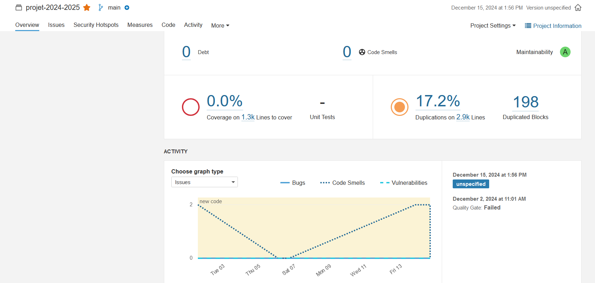

# *Bomberman* en JavaFX

## Description

Ce projet fournit une implantation de base du jeu *Bomberman* en *JavaFX*.
Pour pouvoir développer votre propre implantation de ce projet, vous devez
en créer une **divergence** en cliquant sur le bouton `Fork` en haut à droite
de cette page.

Lorsque ce sera fait, vous pourrez inviter les membres de votre groupe en tant
que *Developer* pour vous permettre de travailler ensemble sur ce projet.

## Consignes

Vous pouvez retrouver ci-dessous les liens vers les sujets de TP vous guidant
dans le développement de votre projet.

- [Lancement du projet](https://gitlab.univ-artois.fr/enseignements-rwa/modules/but-2/r3-04/tp/-/tree/main/TP03)

## Diagramme de classes

```plantuml
@startuml
package bomberman{

package controller {
    class BombermanController {
        - BombermanGame game
        - Stage stage
        - GridPane backgroundPane
        - Pane movingPane
        - Label score
        - Label bombs
        - Label life
        - Label message
        - boolean started
        + void setStage(Stage stage)
        + void setGame(BombermanGame game)
        + void prepare(GameMap map)
        - void createBackground(GameMap map)
        - void addKeyListeners()
        - void handleKeyTyped(KeyEvent e)
        - void returnToMainMenu()
        - void handleKeyPressed(KeyEvent e)
        - void handleKeyReleased(KeyEvent e)
        + void bindScore(IntegerExpression scoreProperty)
        + void bindBombs(IntegerExpression bombsProperty)
        + void bindLife(IntegerExpression lifeProperty)
        + void addMovable(IMovable movable)
        + void gameOver(String endMessage)
        + void reset()
    }

    class HomeController {
        - SpriteStore spriteStore
        - Button buttonLevel1
        - Button buttonLevel2
        - Button buttonLevel3
        - Button buttonLevel4
        + void onClickEasy(ActionEvent actionEvent) throws IOException
        + void onClickMedium(ActionEvent actionEvent) throws IOException
        + void onClickHard(ActionEvent actionEvent) throws IOException
        + void onClickImpossible(ActionEvent actionEvent) throws IOException
    }

    interface IBombermanController {
        + void bindScore(IntegerExpression scoreProperty)
        + void bindBombs(IntegerExpression bombsProperty)
        + void bindLife(IntegerExpression lifeProperty)
        + void addMovable(IMovable movable)
        + void gameOver(String endMessage)
        + void reset()
    }
}

BombermanController --> BombermanGame
BombermanController --> Stage
BombermanController --> GridPane
BombermanController --> Pane
BombermanController --> Label
BombermanController --> KeyEvent
BombermanController --> IntegerExpression
BombermanController --> IMovable
BombermanController --> GameMap
BombermanController ..|> IBombermanController

HomeController --> SpriteStore
HomeController --> Button
HomeController --> ActionEvent
HomeController --> IOException
IOException --> Exception

package model{

package bombs {
    class Bomb {
        - {static} logger LOGGER
        - SpriteStore SPRITESTORE
        - long delai
        - long startTime
        + Bomb(BombermanGame game, double xPosition, double yPosition, Sprite sprite, long delai)
        + void poseBombe()
        + boolean move(long delta)
        + void collidedWith(IMovable other)
        + void explode()
        + void hitEnemy()
        + boolean isEnemy()
        + boolean isPlayer()
        + boolean isExplosion()
        + boolean isEnemyWithLife()
        + boolean isLava()
        + boolean isBomb()
        + boolean isFakeBomb()
        + boolean isBigBomb()
        + boolean isInvisibleBonus()
        + boolean isLifeBonus()
        + boolean isBombBonus()
        + boolean equals(Object o)
        + int hashCode()
    }

    class BigBomb {
        + BigBomb(BombermanGame game, double xPosition, double yPosition, Sprite sprite, long delai)
    }

    class FakeBomb {
        - long delai
        - long startTime
        + FakeBomb(BombermanGame game, double xPosition, double yPosition, Sprite sprite, long delai)
        + void poseBombe()
        + boolean move(long delta)
        + void collidedWith(IMovable other)
        + void explode()
        + void hitEnemy()
        + boolean isEnemy()
        + boolean isPlayer()
        + boolean isExplosion()
        + boolean isEnemyWithLife()
        + boolean isLava()
        + boolean isBomb()
        + boolean isFakeBomb()
        + boolean isBigBomb()
        + boolean isInvisibleBonus()
        + boolean isLifeBonus()
        + boolean isBombBonus()
        + boolean equals(Object o)
        + int hashCode()
    }

    interface IBomb {
        + void poseBombe()
        + void explode()
    }

    class AbstractMovable {

    }

    interface IMovable {

    }
}

Bomb ..|> IBomb
BigBomb ..|> IBomb
FakeBomb ..|> IBomb
FakeBomb --|> AbstractMovable
BigBomb --|> AbstractMovable
Bomb --|> AbstractMovable
AbstractMovable ..|> IMovable

package bonus {
    class BombBonus {
        - Bomb bomb
        - SpriteStore spriteStore
        + BombBonus(BombermanGame game, double xPosition, double yPosition, Sprite sprite)
        + void collidedWith(IMovable other)
        + void explode()
        + void hitEnemy()
        + boolean isEnemy()
        + boolean isPlayer()
        + boolean isExplosion()
        + boolean isEnemyWithLife()
        + boolean isLava()
        + boolean isBomb()
        + boolean isFakeBomb()
        + boolean isBigBomb()
        + boolean isInvisibleBonus()
        + boolean isLifeBonus()
        + boolean isBombBonus()
        + void degrade(Wall wall)
    }

    class LifeBonus {
        - SpriteStore spriteStore
        + LifeBonus(BombermanGame game, double xPosition, double yPosition, Sprite sprite)
        + void collidedWith(IMovable other)
        + void explode()
        + void hitEnemy()
        + boolean isEnemy()
        + boolean isPlayer()
        + boolean isExplosion()
        + boolean isEnemyWithLife()
        + boolean isLava()
        + boolean isBomb()
        + boolean isFakeBomb()
        + boolean isBigBomb()
        + boolean isInvisibleBonus()
        + boolean isLifeBonus()
        + boolean isBombBonus()
        + void degrade(Wall wall)
    }

    class InvisibleBonus {
        - SpriteStore spriteStore
        + InvisibleBonus(BombermanGame game, double xPosition, double yPosition, Sprite sprite)
        + void collidedWith(IMovable other)
        + void explode()
        + void hitEnemy()
        + boolean isEnemy()
        + boolean isPlayer()
        + boolean isExplosion()
        + boolean isEnemyWithLife()
        + boolean isLava()
        + boolean isBomb()
        + boolean isFakeBomb()
        + boolean isBigBomb()
        + boolean isInvisibleBonus()
        + boolean isLifeBonus()
        + boolean isBombBonus()
        + void degrade(Wall wall)
    }

    interface IWallState {
        + void explode()
        + void hitEnemy()
        + boolean isEnemy()
        + boolean isPlayer()
        + boolean isExplosion()
        + boolean isEnemyWithLife()
        + boolean isLava()
        + boolean isBomb()
        + boolean isFakeBomb()
        + boolean isBigBomb()
        + boolean isInvisibleBonus()
        + boolean isLifeBonus()
        + boolean isBombBonus()
        + void degrade(Wall wall)
    }

    class AbstractMovable {
        + boolean move(long delta)
        + void collidedWith(IMovable other)
    }

    interface IMovable {
        + boolean move(long delta)
        + void collidedWith(IMovable other)
    }

    class SpriteStore {
        + static SpriteStore getInstance()
        + Sprite getSprite(String name)
    }

    class Sprite {
    }
}

BombBonus --|> AbstractMovable
LifeBonus --|> AbstractMovable
InvisibleBonus --|> AbstractMovable
BombBonus ..|> IWallState
LifeBonus ..|> IWallState
InvisibleBonus ..|> IWallState
AbstractMovable ..|> IMovable
SpriteStore --> Sprite
InvisibleBonus --> SpriteStore
LifeBonus --> SpriteStore
BombBonus --> SpriteStore

package map {
    package wallstate {
        interface IWallState {
            + void degrade(Wall wall)
            + Sprite getSprite()
        }

        class WallInvincibleState implements IWallState {
            - Sprite SPRITE
            + WallInvincibleState(Sprite sprite)
            + void degrade(Wall wall)
            + Sprite getSprite()
        }

        class CrackedBrickWallState implements IWallState {
            - Sprite SPRITE
            - BombermanGame GAME
            - SpriteStore SPRITESTORE
            - Random RANDOM

            + CrackedBrickWallState(Sprite sprite)
            + void degrade(Wall wall)
            + Sprite getSprite()
        }

        class BrickWallState implements IWallState {
            - Sprite SPRITE
            - SpriteStore SPRITESTORE
            + BrickWallState(Sprite sprite)
            + void degrade(Wall wall)
            + Sprite getSprite()
        }

        Wall ..> IWallState : "state"
    }

    package mapgenerator {
        interface IMapGenerator {
            + GameMap genererMap();
        }

        abstract class MapGenerator {
            - int HEIGHT
            - int WIDTH
            # SpriteStore spriteStore

            + MapGenerator(int height, int width)
            + GameMap genererMap()
            # abstract Cell generateCell(int i, int j)
            - boolean isBorder(int i, int j)
            - boolean isWallPosition(int i, int j)
            + int getHeight()
            + int getWidth()
        }

        MapGenerator ..|> IMapGenerator

        class MapGenerator1 {
            - Random RANDOM
            + MapGenerator1(int height, int width)
            # Cell generateCell(int i, int j)
            - isBorder(int i, int j)
            - isWallPosition(int i, int j)
        }

        class MapGenerator2 {
            - Random RANDOM
            + MapGenerator2(int height, int width)
            # Cell generateCell(int i, int j)
            - isBorder(int i, int j)
            - isWallPosition(int i, int j)
        }

        class MapGenerator3 {
            - Random RANDOM
            + MapGenerator3(int height, int width)
            # Cell generateCell(int i, int j)
            - isBorder(int i, int j)
            - isWallPosition(int i, int j)
        }

        class MapGenerator4 {
            - Random RANDOM
            + MapGenerator4(int height, int width)
            # Cell generateCell(int i, int j)
            - isBorder(int i, int j)
            - isWallPosition(int i, int j)
        }

        MapGenerator1 --|> MapGenerator
        MapGenerator2 --|> MapGenerator
        MapGenerator3 --|> MapGenerator
        MapGenerator4 --|> MapGenerator

        interface IMapFactory {
            + GameMap createMap();
        }

        class MapFactory {
            - int height
            - int width
            - SpriteStore spriteStore

            + MapFactory(int height, int width, SpriteStore spriteStore)
            + GameMap createMap(String type)
        }

        MapFactory ..|> IMapFactory
        MapFactory o--> MapGenerator : utilise
    }

    class Wall {
        - IWallState state
        + void setState(IWallState state)
        + void degrade()
        + Sprite getSprite()
    }

    Wall --> IWallState : "state"

    class GameMap {
        + void addComponent(IMapComponent component)
        + void displayComponents()
    }

    interface IMapComponent {
        + void add(IMapComponent component)
        + void remove(IMapComponent component)
        + IMapComponent getChild(int index)
        + void display()
    }

    class Cell {
            - int row
            - int column
            - ObjectProperty<Sprite> spriteProperty
            - ObjectProperty<Wall> wallProperty

            + Cell(int row, int column)
            + Cell(Sprite sprite)
            + Cell(Wall wall)

            + int getRow()
            + int getColumn()
            + int getWidth()
            + int getHeight()
            + Sprite getSprite()
            + void setSprite(Sprite sprite)
            + Wall getWall()
            + void setWall(Wall wall)
    }

    class ObjectProperty<T> {
        - T value
        + T get()
        + void set(T value)
    }

    class Column {
    }

    class Row {
    }
}

Wall ..|> IWallState
Cell ..> Sprite
Cell ..> Wall
GameMap ..|> IMapComponent
Cell ..|> IMapComponent

class BombermanAnimation {
        - movableObjects : List<IMovable>
        - previousTimestamp : long
        + BombermanAnimation(movableObjects: List<IMovable>)
        + start() : void
        + handle(now: long) : void
        - moveObjects(delta: long) : void
        - checkCollisions() : void
    }

    interface IMovable {
        + move(delta: long) : void
        + isCollidingWith(other: IMovable) : boolean
        + collidedWith(other: IMovable) : void
    }

    BombermanAnimation --> IMovable : uses

class BombermanGame {
        - Random RANDOM
        - int DEFAULT_SPEED
        - int DEFAULT_BOMBS
        - int width
        - int height
        - IMapFactory mapFactory
        - ISpriteStore spriteStore
        - IntegerProperty remainingBombs
        - int nbEnemies
        - int nbBoss
        - int nbSousBoss
        - List<IMovable> movableObjects
        - AnimationTimer animation
        - GameMap gameMap
        - Player player
        - int remainingEnemies
        - IBombermanController controller
        - IMapGenerator generateurMap
        - int difficultyLevel
        + BombermanGame(int, int, ISpriteStore, int, int, int)
        + void start(int)
        + void prepare(int)
        + void incrementBombCount()
        + void decreaseBombs()
        + int getRemainingBombs()
        + IntegerProperty remainingBombsProperty()
        + void setController(IBombermanController)
        + ISpriteStore getSpriteStore()
        + int getWidth()
        + int getHeight()
        + void setMapFactory(IMapFactory)
        + void setDifficultyLevel(int)
        + int getDifficultyLevel()
    }

    interface IMovable {
        + void move()
    }

    class Player {
        + void addBomb(Bomb)
        + int getX()
        + int getY()
    }

    class Bomb {
        + Bomb(BombermanGame, int, int, Sprite, int)
    }

    class GameMap {
        // Présence d'autres méthodes et attributs
    }

    interface ISpriteStore {
        + Sprite getSprite(String)
    }

    interface IBombermanController {
        + void prepare(GameMap)
    }

    class Enemy {
        + Enemy(BombermanGame, int, int, Sprite, IMovement)
    }

    class EnemyWithLife {
        + EnemyWithLife(Enemy, int)
        + void setHorizontalSpeed(int)
    }

    interface IMovement {
        + void move()
    }

    class RandomMovement {
        + void move()
    }

    class InteligentMovement {
        + void move()
    }

    class Sprite {
        // Les attributs et méthodes pour les sprites
    }

    class BombermanAnimation {
        + BombermanAnimation(List<IMovable>)
    }


    class GetGameInstance {
        - static BombermanGame instance
        - GetGameInstance()
        + static BombermanGame getInstance()
        + static void setInstance(BombermanGame)
    }

 interface IBombermanController {
        + void setGame(BombermanGame game)
        + void prepare(GameMap map)
        + void bindScore(IntegerExpression scoreProperty)
        + void bindBombs(IntegerExpression bombsProperty)
        + void bindLife(IntegerExpression lifeProperty)
        + void addMovable(IMovable movable)
        + void gameOver(String endMessage)
        + void reset()
    }

    interface IMovable {
        + int getWidth()
        + int getHeight()
        + void setX(int xPosition)
        + int getX()
        + DoubleProperty getXProperty()
        + void setY(int yPosition)
        + int getY()
        + DoubleProperty getYProperty()
        + void consume()
        + boolean isConsumed()
        + BooleanProperty isConsumedProperty()
        + void setHorizontalSpeed(double speed)
        + double getHorizontalSpeed()
        + void setVerticalSpeed(double speed)
        + double getVerticalSpeed()
        + void addBomb(Bomb bomb)
        + void addLife(int life)
        + void setSprite(Sprite sprite)
        + Sprite getSprite()
        + ObjectProperty<Sprite> getSpriteProperty()
        + boolean move(long timeDelta)
        + boolean isCollidingWith(IMovable other)
        + void collidedWith(IMovable other)
        + void explode()
        + void hitEnemy()
        + IMovable self()
        + boolean isEnemy()
        + boolean isPlayer()
        + boolean isExplosion()
        + boolean isEnemyWithLife()
        + boolean isLava()
        + boolean isBomb()
        + boolean isFakeBomb()
        + boolean isBigBomb()
        + boolean isInvisibleBonus()
        + boolean isLifeBonus()
        + boolean isBombBonus()
    }

IMovable --> Bomb : "ajoute"
IMovable --> Sprite : "utilise"
IBombermanController --> BombermanGame : "associe"
IBombermanController --> GameMap : "utilise"
IBombermanController --> IMovable : "ajoute"


GetGameInstance --> BombermanGame : "utilise"

BombermanGame --> ISpriteStore
BombermanGame --> GameMap
BombermanGame --> IBombermanController
BombermanGame --> IMapFactory
BombermanGame --> IMapGenerator
BombermanGame --> IMovable
BombermanGame --> Player
BombermanGame --> Bomb
BombermanGame --> Enemy
BombermanGame --> EnemyWithLife
IMovable <|-- Player
IMovable <|-- Enemy
IMovable <|-- EnemyWithLife
IMovement <|-- RandomMovement
IMovement <|-- InteligentMovement
BombermanGame --> Sprite
BombermanGame --> BombermanAnimation


}


package view {

    interface ISpriteStore {
        + getSprite(identifier: String): Sprite
        + getSpriteSize(): int
    }

    class Sprite {
        - image: Image
        + Sprite(image: Image)
        + getWidth(): int
        + getHeight(): int
        + getImage(): Image
        + draw(graphics: GraphicsContext, x: int, y: int): void
    }

    class SpriteAnimator {
        - frames: List<Image>
        - currentFrameIndex: int
        - animation: Timeline
        + SpriteAnimator(frames: List<Image>, frameDuration: int)
        - nextFrame(): void
        + getCurrentFrame(): Image
        + start(): void
        + stop(): void
    }

    class SpriteStore {
        - instance: SpriteStore
        - spriteCache: Map<String, Sprite>
        + getInstance(): SpriteStore
        + getSprite(identifier: String): Sprite
        - loadImage(name: String): Image
    }

    ISpriteStore <|.. SpriteStore
    SpriteStore --* Sprite
    SpriteAnimator --* Image

    Sprite o-- "1" Image : has

}
}
@enduml
```

## Tâches réalisées

### TP n°3

| Fonctionnalité                         | Terminée ? | Auteur(s) |
|----------------------------------------|------------|-----------|
| Représentation des ennemis             | ✅          | Benjamin  |
| Intégration des ennemis dans la partie | ✅          | Benjamin  |
| Représentation du player               | ✅          | Mathias   |
| Intégration du player dans la partie   | ✅          | Mathias   |
| Représentation des bombes et explosion | ✅          | Mathéo    |
| Intégration des bombes dans la partie  | ✅          | Mathéo    |
| Création de la carte du jeu            | ✅          | Simon     |

### TP n°4

| Fonctionnalité                              | Patron de conception utilisé | Terminée ? | Auteur(s)          |
|---------------------------------------------|------------------------------|------------|--------------------|
| Variantes de déplacement des ennemis        | Stratégie                    | ✅          | Benjamin           |
| Gestion des points de vie (ennemis, player) | Décorateur                   | ✅          | Mathias / Benjamin |
| Invulnérabilité du player                   | Etat                         | ✅          | Mathias            |
| Solidité des murs                           | Etat                         | ✅          | Simon / Matheo     |
| Variantes de génération pour la carte       | Fabrique abstraite           | ✅          | Simon              |
| Différents types de bombes                  | Fabrique abstraite           | ✅          | Matheo             |

### TP n°5

| Fonctionnalité                  | Patron de conception utilisé   | Terminée ? | Auteur(s)            |
|---------------------------------|--------------------------------|------------|----------------------|
| Instance du `SpriteStore`       | Singleton                      | ✅          | Mathias              |
| Bonus de bombe                  |                                | ✅          | Benjamin             |
| Bonus d'invulnérabilité         |                                | ✅          | Benjamin             |
| Bonus de point de vie           |                                | ✅          | Benjamin             |
| Apparition aléatoire d'un bonus |                                | ✅          | Benjamin             |
| Gestion des différents niveaux  | Fabrique abstraite / Composite | ✅          | Matheo/Simon/Mathias |

### Note SonarQube :




### Fin projet


